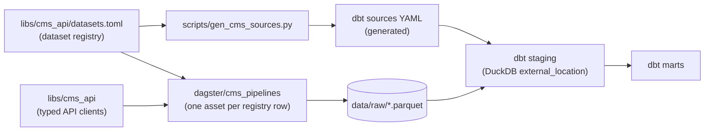

# cms-open-data

[](https://github.com/turnerluke/cms-open-data/actions/workflows/lint.yml)
[](https://github.com/turnerluke/cms-open-data/actions/workflows/test.yml)
[](LICENSE)
[](pyproject.toml)

A registry of 40 CMS datasets — Provider Data Catalog, `data.cms.gov`
bulk files, Open Payments, Medicaid, and healthcare.gov — drives a
Dagster pipeline that lands each dataset as Parquet, and dbt models the
results on DuckDB.
Typed API clients, orchestration, and transformations live together in
one uv workspace.

## Architecture



Data flows left to right: [`libs/cms_api`](libs/cms_api/README.md)
provides typed clients for CMS public APIs;
[`dagster/cms_pipelines`](dagster/cms_pipelines/README.md) generates one
Dagster asset per `[[dataset]]` row in
[`libs/cms_api/datasets.toml`](libs/cms_api/datasets.toml) and lands each
extract under `data/raw/` as Parquet;
[`dbt/cms_analytics`](dbt/cms_analytics/README.md) reads that Parquet
directly via DuckDB `external_location` sources and models it through
staging into marts.

## The dataset registry

One TOML file drives everything. Each `[[dataset]]` row in
[`libs/cms_api/datasets.toml`](libs/cms_api/datasets.toml) declares a
dataset's key, source API, identifier, and description — and from that
single row:

- **A Dagster asset appears automatically.** The factory in
  `dagster/cms_pipelines/src/cms_pipelines/defs/cms/registry_assets.py`
  emits one `@asset` named `cms_<key>` per row, routed to the right
  `cms_api` client for its source.
- **The dbt sources file is generated.** `scripts/gen_cms_sources.py`
  regenerates `dbt/cms_analytics/models/staging/cms/_cms__sources.yml`
  from the registry — a pre-commit hook runs it on every commit, and a
  CI test fails if the YAML ever drifts from the TOML.

Adding a dataset to the platform is one TOML row. No new asset module,
no hand-edited YAML, and no way for the orchestration layer and the
modeling layer to disagree about what exists.

## Quickstart

Requires [uv](https://docs.astral.sh/uv/) and Python 3.13+.

```bash
git clone https://github.com/turnerluke/cms-open-data.git
cd cms-open-data
uv sync --all-packages --all-groups
```

Materialize an asset (lands Parquet under `data/raw/`):

```bash
cd dagster/cms_pipelines
uv run dg launch --assets cms_hospital_general_information
```

Or launch the Dagster UI at `http://localhost:3000` and materialize
assets from there:

```bash
uv run dg dev
```

Then model the landed data with dbt:

```bash
cd ../../dbt/cms_analytics
uv run dbt deps
uv run dbt build --profiles-dir .
```

No credentials are required — every source is a public API.
`CMS_API_SOCRATA_APP_TOKEN` can optionally be set to raise Socrata rate
limits (see the [`cms_api` README](libs/cms_api/README.md) for all
configuration knobs).

## Dashboards

[Evidence](https://evidence.dev) dashboards over the dbt marts live in
`evidence/`. They read `data/warehouse.duckdb` directly, so build the
warehouse first — either run the Dagster `full_refresh_job` (extracts
every registry dataset, then runs dbt) or follow the Quickstart above —
then start the dev server (requires Node 18+):

```bash
cd evidence
npm install
npm run dev
```

`npm run build` renders the same pages to a static site in
`evidence/build/`.

## Repo layout

| Path                                                        | What it is                                                  |
| ----------------------------------------------------------- | ----------------------------------------------------------- |
| [`libs/cms_api/`](libs/cms_api/README.md)                   | Typed Python clients for CMS public APIs + dataset registry |
| [`dagster/cms_pipelines/`](dagster/cms_pipelines/README.md) | Dagster orchestration — registry-generated assets           |
| [`dbt/cms_analytics/`](dbt/cms_analytics/README.md)         | dbt models on DuckDB (staging → marts)                      |
| `evidence/`                                                 | Evidence dashboards over the dbt marts                      |
| [`docs/`](docs/)                                            | Docs and policies (testing standards, `typing.Any` ban)     |
| [`docs/DEVELOPMENT.md`](docs/DEVELOPMENT.md)                | How the repo is built — dev setup, agent tooling, standards |
| `scripts/`                                                  | Maintenance tooling, incl. the dbt-sources generator        |
| `tests/`                                                    | Repo-wide standards tests (layout, coverage, sync checks)   |
| `data/`                                                     | Local landing zone: raw Parquet extracts + DuckDB warehouse |

## Status

Extraction is the mature half of this project: every registry dataset
has a Dagster asset that extracts it to Parquet. The dbt layer is
early — one staging model exists today, and the intermediate and marts
directories are scaffolding. Marts are next.

## License

[MIT](LICENSE)
